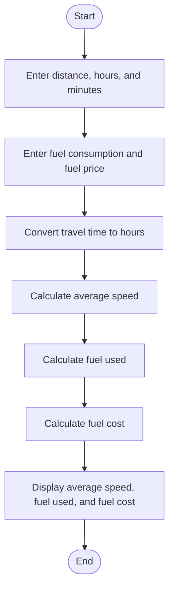

# Trip Speed and Fuel Cost Flowchart

```mermaid
flowchart TD
    A([Start]) --> B["Enter distance, hours, and minutes"]
    B --> C["Enter fuel consumption and fuel price"]
    C --> D["Convert travel time to hours"]
    D --> E["Calculate average speed"]
    E --> F["Calculate fuel used"]
    F --> G["Calculate fuel cost"]
    G --> H["Display average speed, fuel used, and fuel cost"]
    H --> I([End])
```